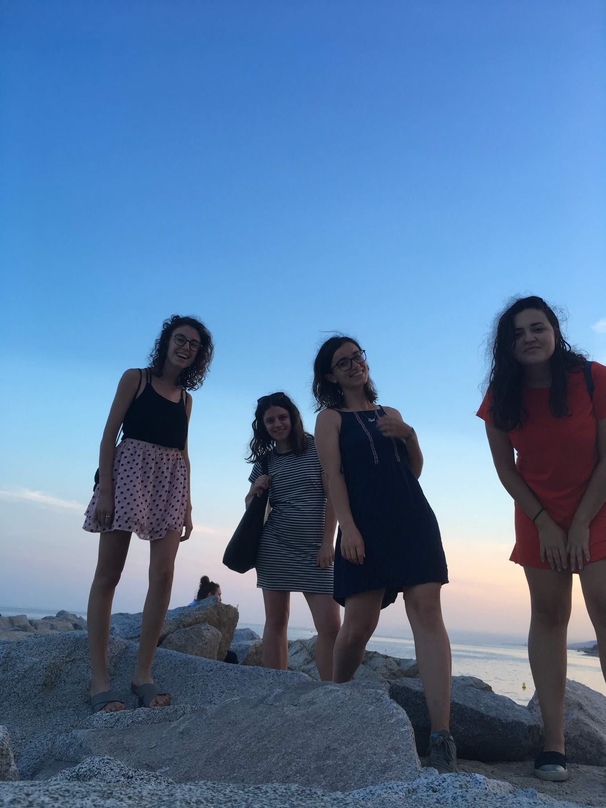

# Homework 1 submission

Hey, all! This is my attempt at making a page with markdown while explaining a bit about myself, my roots and background :)

## Some facts about me!

##### I was born in Albania. Most people I have met here in Vancouver don't know where that is. Others know at least one person from Albania. This says a lot about the country. Here is where it's located. Most people recognize almost immediately the neighbors: Italy and Greece. I have been to both those countries, and love both of them!

##### Fun fact: Mother Teresa is Albanian. She said: 

> Peace begins with a smile.

##### I am a Greek national too. Greek is the second language I'm native in. (Yes, in Albania people speak Albanian, which is a pretty cool, and very [unique language](https://en.wikipedia.org/wiki/Albanian_language). It has, in fact, a separate branch in the indo-european [language tree](https://www.translatemedia.com/wp-content/cache/thumbnails/2015/07/linguist-family-tree2-860x9999.jpg))

##### I arrived to Vancouver on 30th of August 2018. Before coming here, I lived in a few places, mostly in Europe. The greener the color, the more I have stayed there.


##### I studied Computer Engineering at [Bilkent University](http://w3.bilkent.edu.tr/bilkent/) in Turkey, and only recently graduated. Here is a picture of me in my graduation gown:


##### And this summer I was in Switzerland, working for [Google](https://www.google.com/) as an intern in their Zurich office. To me, Zurich is heaven on Earth. Just have a look at this picture I took when I went to the Rigi mountain with my parents. 


##### I understand 7 and 1/2 languages. I know how to buy bread, beer and ask for directions in North and South America, Spain, Portugal, Great Britain, Ireland, Germany, Switzerland, Austria, Liechtenstein, Louxembourg, Italy, Greece, Turkey and Albania.

##### This is a list of things I have to do before Sunday, Sept 23:

- [ ] Finish HW1 in STAT
- [ ] Finish the Machine Learning homework :sad:
- [ ] Cook for Tuesday's lunch!
- [ ] Go out for beers with friends :bowtie:  
- [ ] Discuss project with my supervisor
- [ ] Stop making lists I never follow :smirk:

##### I also want to learn how to code in [Ruby](https://www.ruby-lang.org/en/). Here is what Ruby looks like:

```
def say_hello(name)
   return “Hello, ” + name
end
puts say_hello('World')
```

##### Finally, here is a collection of photos I have taken this summer. 

###### This is in Glasgow. People there love to drink. This man is, in my opinion, drunk: his nose is red from the cold and the alcohol. Also, I find that he looks a little like a young hipster Robin Williams. Captured on 28th of August 2018.


###### The (very wet) traffic sign for pedestrians in London. It has two modes: wait and cross with care. You'd expect it would be just wait and cross, but I think the city hall is aware a lot of people (drivers and pedestrians alike) can't really get their head around the "opposite" driving in the UK, hence the extra care :smile: I find it pretty funny.


###### This is me (blue dress) and my albanian friends just outside Barcelona on the 9th of August 2018. That's the best day of this summer for me.


### Thanks for bearing with me people. I hope this was not too boring :smirk: .

For testing purposes:

|    **Item**    | **Status** |
|----------------|------------|
| Finished-ness  | :thumbsup: |
| Happiness      | :bowtie:   |
| Markdowny-ness | :octocat:  |
