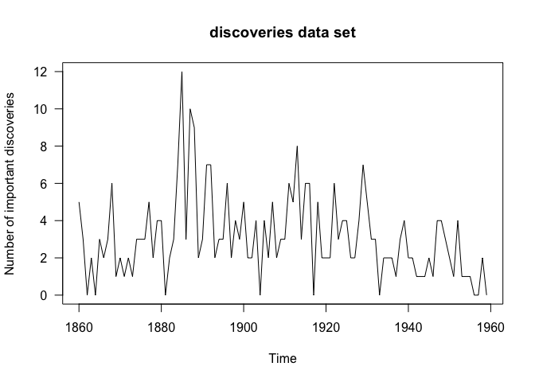
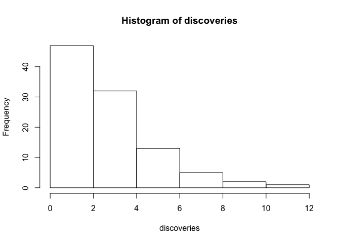

Hw1 Part 2
================

#### I have chosen to work with discoveries data from datasets package.

``` r
require(graphics)
```

``` r
length(discoveries)
```

    ## [1] 100

``` r
summary(discoveries)
```

    ##    Min. 1st Qu.  Median    Mean 3rd Qu.    Max. 
    ##     0.0     2.0     3.0     3.1     4.0    12.0

``` r
str(discoveries)
```

    ##  Time-Series [1:100] from 1860 to 1959: 5 3 0 2 0 3 2 3 6 1 ...

Some Plots
----------

``` r
plot(discoveries, ylab = "Number of important discoveries",
     las = 1)
title(main = "discoveries data set")
```



``` r
hist(discoveries)
```


